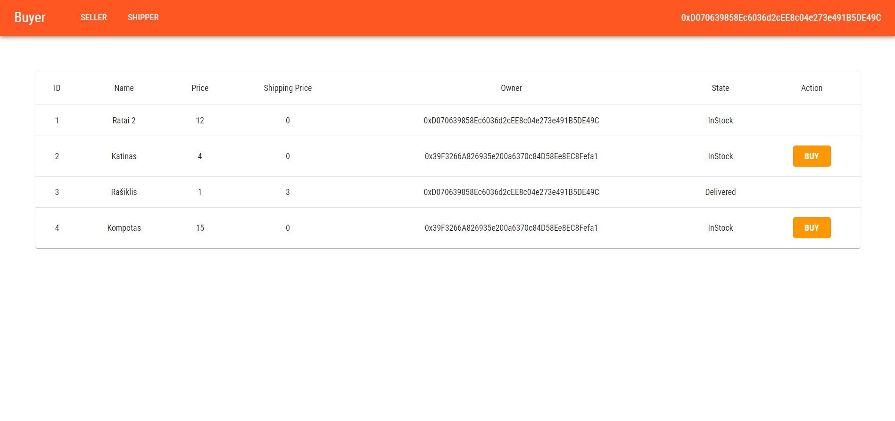

# Smart-contract-market



This web-app implements very simplified *Ebay* like service based on Ethereum currency and smart contract.

## What can I do?

1. Seller enters information about the good.
2. Buyer buys the good.
3. Shipper must mark product as shipped after they ship it.
4. Buyer marks their purchase as delivered

> Note: Money is transferred to seller and shipper after good cycles through every step in the purchase and buyer marks the good as *Delivered*


## But why smart contract?

 Regular services make all 3 actors (buyer, seller and shipper) trust the service and its processes. However, smart contracts ensure the **legitimacy** of every party even better! By taking the third party role it moderates the whole scenario. What is more, since the smart contract is a simple program with deterministic results, it is clear that every operation will always be valid and no money will be stolen neither by contract nor by any of the parties. 


## Ok, I'm interested... How could I test it?

Easy peasy lemon squeezy

- Make sure to have **Node.js**, **Ganache** and **Truffle**
- Clone this repository
- Start ganache server, set-up Meta-mask in your browser
- Run ``` npm install ``` to install required packages
- Run client by typing ``` npm start ```
- Open http://localhost:3000/
- Voila!


## Changelog

### [v0.1]( https://github.com/zygisau/Smart-contract-market/releases/tag/v0.1) - (2019-12-28)  

  **Koreguota**  

 - README.md faile pridėtas versijos aprašymas.  
  
   **Pridėta**  
  
 - Sukurtas web klientas

 - Sukurtas smart kontraktas, realizuojantis parduotuvės scenarijų